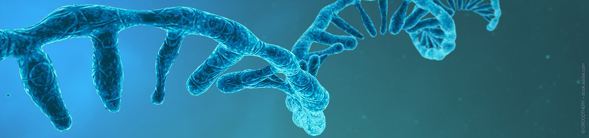
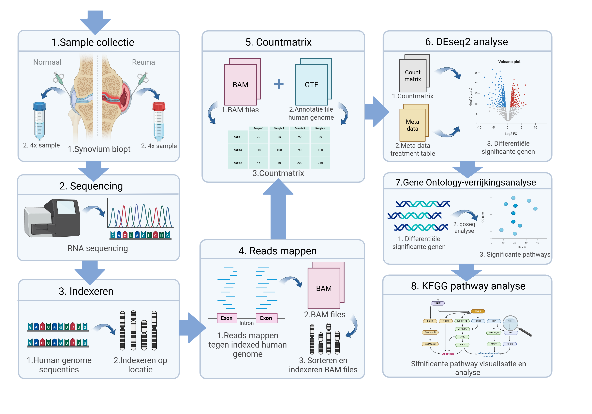

# Transcriptomics rheumatoïde arthritis

  

# 🧬 Pro-inflammentoire genen, cytokines en cellen zijn up-gereguleerd in patiënten met RA waardoor immuun-balans wordt verstoord

Brief one-liner describing the project, e.g., "Differential Gene Expression and GO/KEGG Pathway Analysis in Rheumatoid Arthritis Patients"

---

## 📁 Inhoud/structuur

- `data/raw/` – fictionele datasets voor de analyse van spreuk effectiviteit, gevaar en welke spreuken het beste samengaan met verschillende types staf.  
- `data/processed` - verwerkte datasets gegenereerd met scripts 
- `scripts/` – scripts om prachtige onzin te genereren
- `resultaten/` - grafieken en tabellen
- `bronnen/` - gebruikte bronnen 
- `README.md` - het document om de tekst hier te genereren
- `assets/` - overige documenten voor de opmaak van deze pagina
- `data_stewardship/` - Voor de competentie beheren ga je aantonen dat je projectgegevens kunt beheren met behulp van GitHub. In deze folder kan je hulpvragen terugvinden om je op gang te helpen met de uitleg van data stewardship. 

---

## 🧬 Introduction

Genexpressie is de expressie van een fenotype door transcriptie en translatie (Buccitelli & Selbach, 2020). Transcriptomics is de studie van het transcriptoom wat iets over de genexpressie zegt. Hiermee kunnen effecten en oorzaken van ziektebeelden worden onderzocht. (Khodadadian et al., 2020).
Reumatoïde artritis (RA) is een chronische auto-immuunziekte waarbij systematische synovitis en bot- en gewrichtsafbraak optreedt. 5 op de 1000 volwassenen heeft RA waarvan 5-20% van de patiënten slecht op anti-reumatische medicatie reageert. RA ontstaat onder anderen door genetische factoren. De complexiteit van het ziekteverloop en de onbekende oorzaak van RA zorgen ervoor dat het moeilijk behandelbaar is. (Suwa et al., 2023)
De precieze oorzaak van RA is onbekend, maar genetische factoren spelen een rol. Door de oorzaak van RA te onderzoeken kunnen gerichtere therapieën en preventie worden ontwikkeld. Dit onderzoek vergelijkt m.b.v transcriptomics verschillen in genexpressie tussen RA en normale personen om de pathogenese beter te begrijpen.

---

## 🧪 Methode

<table align="center" width="800">
  <tr>
    <td align="center">
       
      <em>Figuur 1: Flowschema transcriptomics analyse. Een weergave van de methode van de transcriptomics analyse in R vanaf sample collectie tot statistische analyses.</em>
    </td>
  </tr>
</table>

### 🔹 Data
Er werden 4 samples van personen zonder RA (ACPA negatief) en 4 samples van personen met RA (diagnose van >12 maanden, ACPA positief) verkregen uit een synoviumbiopt. Informatie over deelnemers is te vinden in [Data/Meta_data.pdf](Data/Meta_data.pdf). Sequencing werd uitgevoerd waarna een transcriptomics analyse werd uitgevoerd in R, scripts zijn te vinden in [Scripts/R_script_transcriptomics_reuma.R](Scripts/R_script_transcriptomics_reuma.R) en flowschema is weergegeven in figuur 1.

### 🔹 Sorteren, indexeren en countmatrix
Het referentiegenoom werd geïndexeerd met behulp van het menselijke referentiegenoom uit het NCBI-file: GCF_000001405.40_GRCh38.p14_genomic.fna, en de packages BiocManager en Rsubread. Monsters werden gemapt tegen het geïndexeerde referentiegenoom waaruit BAM-files ontstonden. BAM-files werden gesorteerd en geïndexeerd m.b.v Rsamtools.  M.b.v readr, dplyr, Rsamtools en Rsubread en het annotation NCBI file GCF_000001405.25_GRCh37.p13_genomic.gtf.gz werd een countmatrix gemaakt. Statistiek werd uitgevoerd op de count matrix file: count_matrix.txt. 

### 🔹 DEseq2-, GO- en KEGG-analyse
Een DESeq2-analyse werd uitgevoerd met DESeq2. Resultaten werden gevisualiseerd in een vulcano plot m.b.v EnhancedVolcano en ggplot2. Een Gene Ontology (GO)-verrijkingsanalyse werd m.b.v goseq , geneLenDataBase en org.Dm.eg.db . De 10 meest significante resultaten werden gevisualiseerd. Een KEGG pathway analyse werd uitgevoerd m.b.v KEGGREST en de resultaten van de GO-analyse waarbij de pathway ‘rheumatoide arthritis’  met KEGG ID: hsa05323 uit GO term ‘immune system process’ werd geanalyseerd m.b.v pathview.

---

## 📊 Resultaten
Er werd een transcriptomics analyse in R uitgevoerd waarbij de een DESeq, GO en KEGG-analyses werden toegepast. 

### 🔹 Differenitële genexpressie
Een DESeq analyse werd uitgevoerd om het aantal differentiële significante up- en downgereguleerde genen te bepalen. Resultaten zijn weergegeven in figuur… De meest statistische significante genen die upgereguleerd waren in reumapatiënten waren SRGN, BCL2A1 en downgereguleerde genen waren ANKRD30BL, MT-ND6, SLC9A3R2, ZNF598. 

### 🔹 Rheumatoïde artritis pathway
Een GO analse werd uitgevoerd om differentiële significante pathways te bepalen. GO-analyse resultaten werden gevisualiseerd in figuur …. Uit de analyse bleek dat de pathway  ‘immune system process’ veel differentiele significante genen bevatte. Verder onderzoek naar de pathway werd gedaan met de KEGG analyse, omdat deze pathwat relevant is in verband met reuma. Ondedeel uit de gekozen pathway, de ‘rheumatoide arthiritis’ pathway, werd gevisualiseerd in een KEGG pathway, resultaten zijn weergegeven in figuur … Verschillende genen in de pathway zijn differentieel in expressie. In het begin van de pathway waren genen van dendritische cellen (DC), zelf-reactieve Th1 cellen en synoviale fibroblasten upgereguleerd. Genen die zorgen voor angiogenesis, infiltratie van inflammatoire cellen (CCL en CXCL), ontsteking van synoviale pannus (IL6 en IL1β), gewrichts-en botafbraak (osteoclasten) waren sterk upgereguleerd. 

---

## Conclusion

