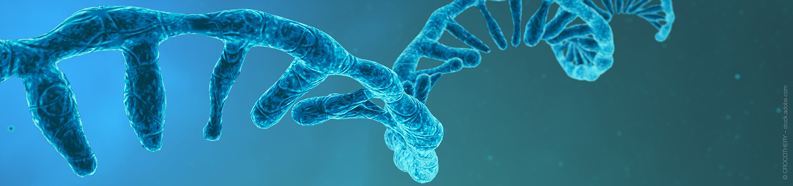
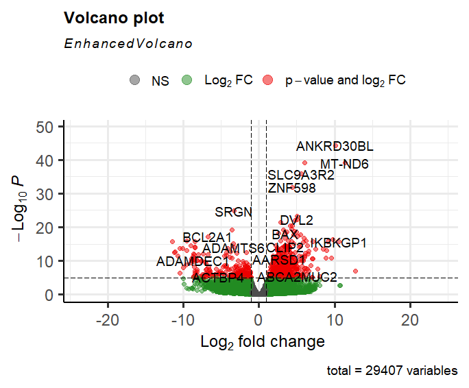
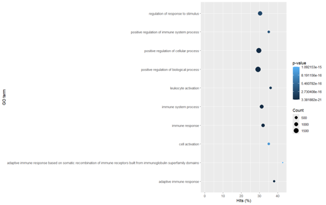
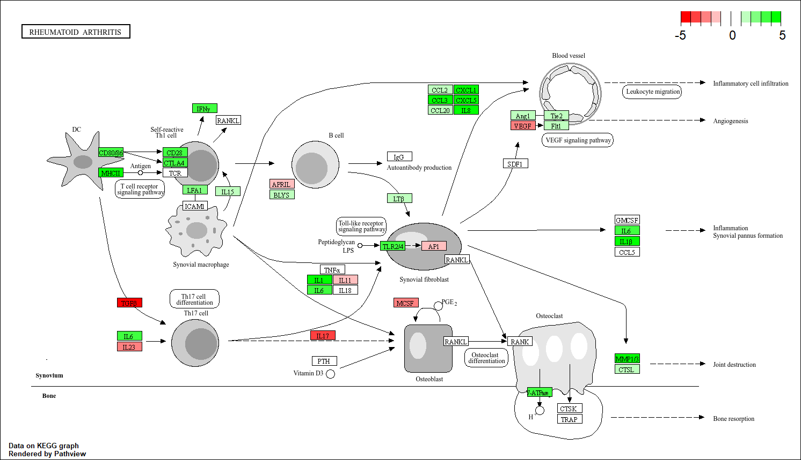

  

(NucleoSpin RNA, Mini Kit for RNA Purification, 2024)

# 🧬 Pro-inflammentoire genen, cytokines en cellen zijn up-gereguleerd in patiënten met RA waardoor immuun-balans wordt verstoord
Dit onderzoek weergeeft de invloed van genexpressie op de pathogenese van reumatoïde artritis m.b.v een transcriptomics analyse in R.

---

## 📁 Inhoud/structuur

- `Assets/` - Figuren voor de opmaak van deze README.md pagina
- `Bronnen/Literatuurlijst` - Gebruikte bronnen voor het onderzoek
- `Data/Ruwe_data/` – Ruwe sequencing data van paired-end reads verkregen van RA-patiënten en gezonde personen
- `Data/Processed_data` - Verwerkte datasets gegenereerd met scripts
- `Data_stewardship/` - Uitleg over data stewardship in het algemeen en hoe het is toegepast tijdens dit onderzoek
- `Resultaten/` - Figuren en tabellen gegenereerd met scripts
- `Scripts/` – R-script voor het uitvoeren van transcriptomicsanalyse
- `README.md` - Het document om de tekst hier te genereren

---

## 🧬 Introductie
Transcriptomics is de studie van het transcriptoom, met als doel inzicht te verkrijgen in genexpressie. Hiermee kunnen oorzaken en effecten van ziekteprocessen worden geanalyseerd (Khodadadian et al., 2020).
Reumatoïde artritis (RA) is een chronische auto-immuunziekte waarbij systematische synovitis en bot- en gewrichtsafbraak optreedt. 5 op de 1000 volwassenen heeft RA waarvan 5-20% van de patiënten slecht op anti-reumatische medicatie reageert. RA wordt onder anderen veroorzaakt door genetische factoren, maar de precieze oorzaak is nog onduidelijk. De complexiteit van het ziekteverloop en de onbekende oorzaak van RA zorgen ervoor dat het moeilijk behandelbaar is. (Suwa et al., 2023)

De precieze oorzaak van RA is onbekend, maar genetische factoren spelen een rol. Door de oorzaak van RA te onderzoeken kunnen gerichtere therapieën en preventie worden ontwikkeld. Dit onderzoek vergelijkt m.b.v transcriptomics verschillen in genexpressie tussen RA en normale personen waarbij zowel differentieel significante genen als pathways in kaart worden gebracht om de pathogenese beter te begrijpen.

---

## 🧪 Methode

<table align="center" width="800">
  <tr>
    <td align="center">
       
      <em>Figuur 1: Flowschema transcriptomics analyse. Een weergave van de methode van de transcriptomics analyse in R vanaf sample collectie tot statistische analyses ontworpen met behulp van Biorender.</em>
    </td>
  </tr>
</table>

### 🔹 Data
Er werden 4 samples van personen zonder RA (ACPA negatief) en 4 samples van RA-patiënten (diagnose van >12 maanden, ACPA positief) verkregen uit een synoviumbiopt. Informatie over deelnemers is te vinden in [Data/Meta_data.pdf](Data/Meta_data.pdf). Sequencing werd uitgevoerd waaruit paired-end reads ontstonden, waarna een transcriptomics analyse werd uitgevoerd in R. Scripts zijn te vinden in [Scripts/R_script_reuma](Scripts/R_script_transcriptomics_reuma.R) en flowschema is weergegeven in figuur 1.

### 🔹 Sorteren, indexeren en countmatrix
Het referentiegenoom werd geïndexeerd met behulp van het menselijke referentiegenoom uit het NCBI human genome GRCh38.p14 (accession nummer: GCF_000001405.40), en de packages BiocManager (Morgan & Ramos, 2024, v1.30.25) en Rsubread (Shi, Liao, & Smyth, 2024, v2.20.0). Monsters werden gemapt tegen het geïndexeerde referentiegenoom waaruit BAM-files ontstonden, zie [Data/Processed_data](Data/Processed_data). BAM-files werden gesorteerd en geïndexeerd m.b.v Rsamtools (Morgan et al., 2024, v2.22.0).  M.b.v readr (Wickham et al, 2024, v2.1.5), dplyr (Wickham et al., 2023, v1.1.4), Rsamtools en Rsubread en het annotation NCBI-file GRCh37.p13 (accession nummer: GCF_000001405.25) werd een countmatrix gemaakt [bewerkt_countmatrix.csv](Resultaten/bewerkt_countmatrix.csv). Statistiek werd uitgevoerd op de count matrix file [count_matrix.txt](Data/Processed_data/count_matrix.txt). 

### 🔹 DEseq2-, GO- en KEGG-analyse
Een DESeq2-analyse werd uitgevoerd met DESeq2 (Love et al., 2024, v1.46.0). Resultaten werden gevisualiseerd in een volcano plot m.b.v EnhancedVolcano (Blighe et al., 2024, v1.24.0) en ggplot2 (Wickham et al., 2024, v3.5.2). Een Gene Ontology (GO)-verrijkingsanalyse werd uitgevoerd m.b.v goseq (Young, Davidson, & Marini, 2024, v1.58.0), geneLenDataBase (Young, Davidson, & Marini, 2024, v 1.42.0) en org.Dm.eg.db  (Carlson, 2023, v 3.20.0). De 10 meest significante resultaten werden gevisualiseerd. Een padj<0.05 werd als significant beshouwd. Een KEGG-pathway analyse werd uitgevoerd m.b.v KEGGREST (Tenenbaum et al., 2024, v1.46.0) en de resultaten van de GO-analyse waarbij de pathway ‘rheumatoide arthritis’ met KEGG ID: hsa05323 uit GO-term ‘immune system process’ werd geanalyseerd m.b.v pathview (Luo, 2024, v1.46.0).

---

## 📊 Resultaten
Er werd een transcriptomics analyse in R uitgevoerd waarbij de een DESeq, GO en KEGG-analyses werden toegepast. 

### 🔹 Differenitële genexpressie
Een DESeq analyse werd uitgevoerd om het aantal differentiële significante up- en down-gereguleerde genen te bepalen. Resultaten zijn weergegeven in figuur 2.

<table align="center" width="800">
  <tr>
    <td align="center">
       
      <em>Figuur 3: Volcanoplot van differentieel significante genen uit de DEseq-analyse. De Log2 fold change (x-as) uitgezet tegen -Log10P significantie (y-as). De rode punten geven differentieel significante genen weer terwijl de groene punten genen weergeven die niet statistisch significant waren.</em>
    </td>
  </tr>
</table>

Er waren 2085 genen significant up-gereguleerd waarvan de meest significante genen SRGN, BCL2A, ADAMDEC1 waren. Er waren 2487 down-gereguleerde genen waarvan de meest significante ANKRD30BL, MT-ND6, SLC9A3R2, ZNF598 waren, zie tabel …

*Tabel 1. Genen die significante differentiële expressie toonden in RA-patiënten. De meest significante up- en down-gereguleerde genen volgens de DEseq-analyse in R. De functie van de genen wordt beschreven met bijbehorende literatuur.*

| Regulatie         | Gen        | Functie                                                   | Bron                                                                 |
|-------------------|------------|-----------------------------------------------------------|----------------------------------------------------------------------|
| Up-gereguleerd    | SRGN       | Betrokken bij pro-inflammatoire processen                 | (Y. Chen et al., 2020)                                               |
| Up-gereguleerd    | BCL2A1     | Anti-apoptotisch eiwit                                    | (Gao et al., 2023)                                                   |
| Up-gereguleerd    | ADAMDEC1   | Metalloprotease (afbraak eiwitten) en activatie DC’s      | (National Center for Biotechnology Information [NCBI], 2025)         |
| Down-gereguleerd  | ANKRD30BL  | Betrokken bij eiwit-interacties                           | (Deng et al., 2017)                                                  |
| Down-gereguleerd  | MT-ND6     | Mitochondriaal electronentransport door activatie NADH    | (National Center for Biotechnology Information, 2024)                |
| Down-gereguleerd  | SLC9A3R2   | Negatieve regulator endotheel proliferatie                | (Arntz et al., 2024)                                                 |
| Down-gereguleerd  | ZNF598     | Ribosomaal kwaliteitscontrole-eiwit                       | (Oikawa et al., 2023)                                                |

### 🔹 Rheumatoïde artritis pathway
Een GO-analyse werd uitgevoerd om differentiële significante pathways te bepalen. GO-analyse resultaten werden gevisualiseerd in figuur 3. 

<table align="center" width="800">
  <tr>
    <td align="center">
       
      <em>Figuur 3: 10 meest significante GO-terms volgens de GO-analyse. Aantal hits% (x-as) uitgezet tegen de GO-term (y-as). De grootte van de punten geven het aantal counts weer waarnaast de kleur van de punten de p-waarden weergeeft.</em>
    </td>
  </tr>
</table>

Uit de analyse bleek dat de pathway  ‘immune system process’ veel differentiële significante genen bevatte. Omdat deze pathway relevant was i.v.m RA werd verder onderzoek gedaan m.b.v een KEGG-analyse. Uit deze pathway werd de ‘rheumatoide arthiritis’ pathway gevisualiseerd, resultaten zijn weergegeven in figuur 4.

<table align="center" width="800">
  <tr>
    <td align="center">
       
      <em>Figuur 4: Reumatoïde artritis pathway gevisualiseerd uit KEGG-analyse. De pathway met KEGG-ID: hsa05323 geeft het immuun proces in het synovium weer dat is betrokken bij reumatoïde artiritis. Fold changes van genen zijn weergegeven met kleuren, down-gereguleerd genen (rood) en up-gereguleerde genen (groen). </em>
    </td>
  </tr>
</table>

In het synoviale weefsel waren genen van dendritische cellen (DC), zelf-reactieve Th1 cellen en synoviale fibroblasten, genen voor infiltratie van inflammatoire cellen (CCL en CXCL), ontsteking van synoviale pannus (IL6 en IL1β), gewrichts-en botafbraak (osteoclasten) waren sterk up-gereguleerd. Genen betrokken bij angiogenesis (VEGF-pathway) en Th17 differentiatie (TGF-β) waren sterk verlaagd. 

*Tabel 2. Genen die significante differentiële expressie toonden in de Rheumatoide arthritis pathway RA-patiënten. De meest significante up- en down-gereguleerde genen volgens de KEGG-analyse in R. De functie van de genen en het proces waar ze bij betrokken zijn wordt beschreven met bijbehorende literatuur.*

| Regulatie       | Proces                               | Genen                  | Functie                                                                 | Bron                                      |
|------------------|----------------------------------------|--------------------------|-------------------------------------------------------------------------|-------------------------------------------|
| Up-gereguleerd   | Activatie van Th1-cellen door DC’s     | CD80/86, CD28, CTLA4     | Co-stimulator moleculen                                                | Wehr et al., 2019                         |
|                  |                                        | MHCII                    | Activeringsmolecuul                                                    | Wehr et al., 2019                         |
| Up-gereguleerd   | Inflammatie in synoviale pannus        | IL-1β, IL-6              | Pro-inflammatoire cytokines                                            | Wehr et al., 2019                         |
| Up-gereguleerd   | Botafbraak door osteoclasten           | V-ATPase                 | Verankering van osteoclasten aan botoppervlak voor botafbraak         | Kovács et al., 2022                       |
| Up-gereguleerd   | Leukocytmigratie                       | CXCL, CCL                | Chemokines die leukocyten aantrekken naar ontstoken weefsels          | X. Chen et al., 2020; Zhu et al., 2021    |
| Up-gereguleerd   | VEGF-signaalroute                      | Ang1, Tie2               | Ligand en receptor die vaatstabiliteit stimuleren                     | Senna et al., 2013                        |
| Down-gereguleerd | VEGF-signaalroute                | VEGF                     | Groeifactor betrokken bij vorming van bloedvaten (angiogenese)        | Khodadust et al., 2022                    |
| Down-gereguleerd | Differentiatie van Th17-cellen         | TGF-β                    | Cytokine die Th17-differentiatie stimuleert                           | Wang et al., 2023                         |

---

##  📝 Conclusie
Bij dit onderzoek werd de invloed van genexpressie op de pathogenese van RA onderzocht m.b.v transcriptomics. RA is een auto-immuunziekte waarbij het immuunsysteem verstoord is, zoals uit de resultaten bleek. De DEseq analyse toonde dat genen met pro-inflammatoire eigenschappen verhoogd waren, terwijl genen met een functie om balans te behouden verlaagd waren in RA-patiënten. In het synoviale weefsel waren DC’s met MHC-klasse 2 verhoogd, wat leidt tot presentatie van lichaamseigen antigenen aan zelfreactieve Th1-cellen. Deze stimuleren pro-inflammatoire cytokines (zoals IL-1β, IL-6) die synoviumontsteking veroorzaken. Overactieve synoviale fibroblasten activeren osteoclasten, wat botafbraak bevordert. Sterk upgereguleerde chemokines CXCL en CCL trekken lymfocyten aan en veroorzaken zo systemische ontsteking. Veranderingen in VEGF-pathway bleken angiogenese te remmen. Daarnaast was TGF-β sterk verlaagd waarmee pro-inflammatoire Th17-cellen differentiatie werd geremd. Remming van angiogenese en verlaging van TGF-β zijn niet kenmerkend voor RA.

Bij RA zijn pro-inflammatoire genen, cytokines en cellen verhoogd, wat chronische synoviumontsteking en gewrichts- en botafbraak veroorzaakt. Daarnaast zijn genen die balans bewaren verlaagd. Hiermee kan geconcludeerd worden dat genexpressie een belangrijke rol speelt in de pathogenese van RA en geven mogelijkheden voor gerichte therapieën. 
Vroege immuunreactiegenen bleken verhoogd. Verder onderzoek naar interacties tussen DC’s en zelfreactieve Th1-cellen kan bijdragen aan preventie en behandeling

