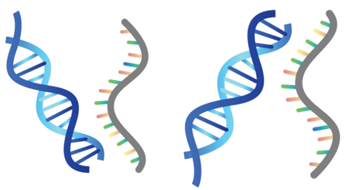
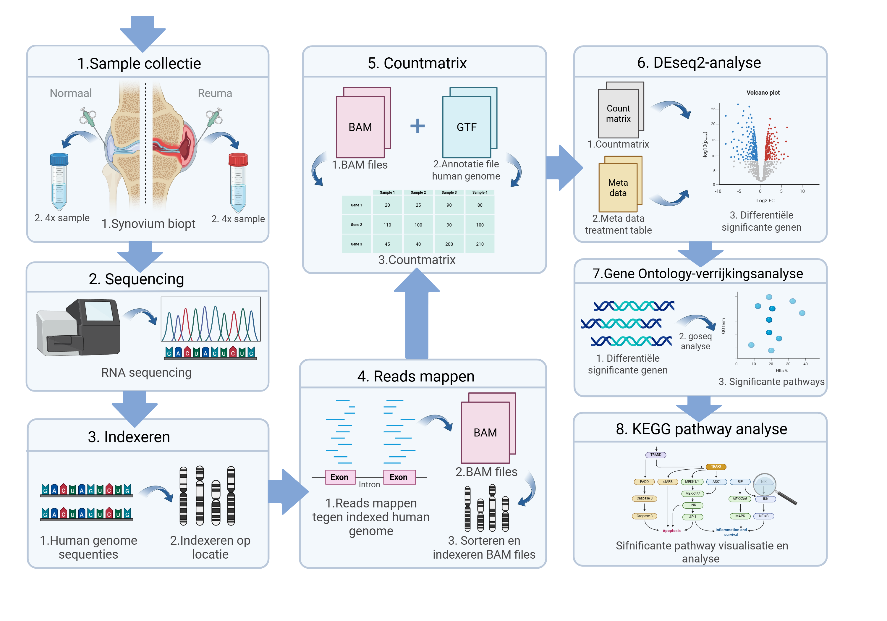

  

# Transcriptomics rheumatoïde arthritis
# 🧬 concluderende titel

Brief one-liner describing the project, e.g., "Differential Gene Expression and GO/KEGG Pathway Analysis in Rheumatoid Arthritis Patients"

---

## 📁 Inhoud/structuur

- `data/raw/` – fictionele datasets voor de analyse van spreuk effectiviteit, gevaar en welke spreuken het beste samengaan met verschillende types staf.  
- `data/processed` - verwerkte datasets gegenereerd met scripts 
- `scripts/` – scripts om prachtige onzin te genereren
- `resultaten/` - grafieken en tabellen
- `bronnen/` - gebruikte bronnen 
- `README.md` - het document om de tekst hier te genereren
- `assets/` - overige documenten voor de opmaak van deze pagina
- `data_stewardship/` - Voor de competentie beheren ga je aantonen dat je projectgegevens kunt beheren met behulp van GitHub. In deze folder kan je hulpvragen terugvinden om je op gang te helpen met de uitleg van data stewardship. 

---

## 🧬 Introduction

Rheumatoid arthritis (RA) is a chronic autoimmune disease that affects joint tissues. The goal of this project is to identify differentially expressed genes (DEGs) between RA and healthy individuals and gain biological insights through GO and KEGG enrichment analyses.

---

## 🧪 Methods

### 🔹 Data

- Raw count matrix from NCBI RNA-seq data
- 8 samples total: 4 RA, 4 Normal

### 🔹 Analysis Pipeline

1. **DESeq2**:
   - Count normalization
   - Differential gene expression (RA vs Normal)
   - Volcano plot visualization

2. **Gene Ontology (GO)**:
   - Enrichment of biological processes using `goseq`
   - Visual representation of top 10 GO terms

3. **KEGG Pathway**:
   - Visualization of enriched pathways using `pathview`
   - Highlighting up- and downregulated genes in RA

---

## 📊 Results

### 🔹 Differential Expression

- Total significant DEGs (FDR < 0.05): **X**
  - Upregulated in RA: **Y**
  - Downregulated in RA: **Z**

### 🔹 Top Genes

- Most upregulated: *GENE_A*, *GENE_B*
- Most downregulated: *GENE_X*, *GENE_Y*

### 🔹 GO Enrichment

- Top enriched biological processes include:
  - Inflammatory response
  - Immune system regulation
  - Cell adhesion

### 🔹 KEGG Pathway

- RA-associated pathway `hsa05323` visualized
- Genes mapped with fold changes (green = upregulated, red = downregulated)

---

## Conclusion

This analysis identified key genes and pathways altered in rheumatoid arthritis. The combination of DESeq2, GO, and KEGG analyses provides biological insight into disease mechanisms, highlighting immune and inflammatory responses as major drivers in RA.

